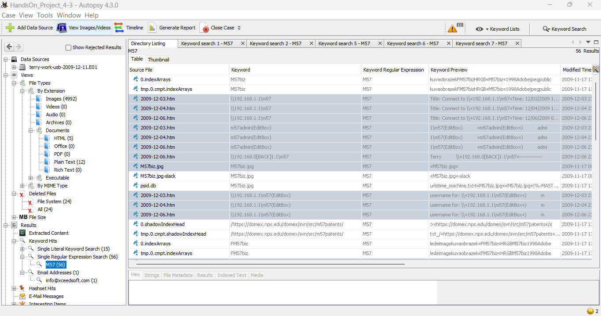
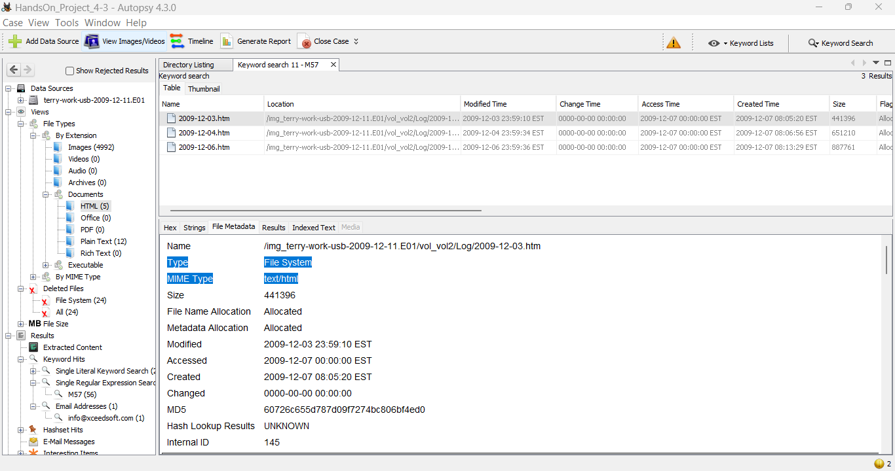
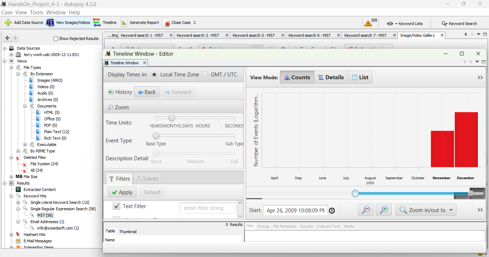
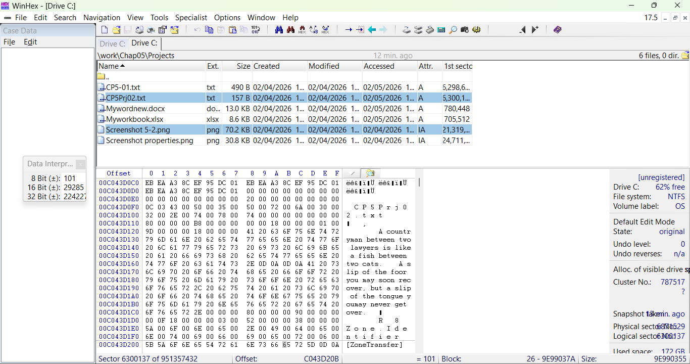
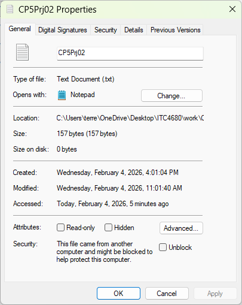

# Digital Forensics Lab – Autopsy & WinHex Analysis

## Project Overview

This lab demonstrates digital forensic analysis using Autopsy 4.3.0 and WinHex. The objective was to examine a forensic image file, perform keyword searches, analyze metadata, review hash values, and construct a timeline of system activity.

The investigation follows standard forensic methodology: acquisition, examination, analysis, and reporting.

---

## 1. Case Setup in Autopsy

### Case Initialization

A forensic image (.E01) was added as a data source inside Autopsy. The case file was configured with examiner details and proper timezone settings.

---

## 2. Keyword Search Analysis

### Keyword Search Results

A keyword search for **"M57"** was conducted across the image. Multiple HTML files and artifacts contained matching results, indicating user activity connected to the M57 dataset.

The search confirmed:

- Multiple references to M57 within log files
- Web activity tied to IP addresses
- User interaction timestamps

---

## 3. File Metadata Examination

### File Metadata Details

Selected files were examined for:

- Created timestamps  
- Modified timestamps  
- Accessed timestamps  
- MD5 hash values  

Metadata confirmed file system allocation status and verified file integrity.

---

## 4. Timeline Analysis

### Timeline View

The Autopsy timeline tool was used to visualize system activity across months.

Findings showed:

- Increased activity in November and December 2009  
- Concentrated modification events  
- Consistent browser log updates  

This helps reconstruct user behavior chronologically.

---

## 5. WinHex Hex-Level Examination

### File Record Inspection

WinHex was used to examine raw file data and verify file contents at the hex level.

Observations:

- NTFS file structure confirmed  
- ASCII data visible within allocated clusters  
- No evidence of corruption  

---

## 6. File Property Verification

### File Properties

File system properties were reviewed to validate:

- File size  
- Allocation status  
- Timestamps  
- Attributes  

All examined files were allocated and consistent with metadata records.

---

## 7. Data Interpreter View

### Data Interpretation Panel

The data interpreter tool confirmed:

- Hex to ASCII conversion  
- Logical file structure  
- Proper sector alignment  

This step verifies forensic accuracy at the binary level.

---

## Forensic Conclusion

The forensic analysis of the provided image revealed consistent user activity tied to the M57 dataset. Keyword searches identified multiple HTML log files referencing internal IP addresses and user sessions.

Timeline analysis confirmed concentrated activity in late 2009. File metadata and hash values indicate no evidence of file tampering or corruption. Hex-level inspection validated file integrity and NTFS structure consistency.

Based on the examination results, the evidence appears intact and reliable. The artifacts recovered provide a clear reconstruction of system usage and web interaction during the relevant time period.

---

## Tools Used

- Autopsy 4.3.0  
- WinHex  
- MD5 Hash Verification  
- Timeline Analysis  
- Keyword Search (Literal & Regex)

---

## Skills Demonstrated

- Forensic Image Analysis  
- Keyword Artifact Identification  
- Metadata Examination  
- Timeline Reconstruction  
- Hash Verification  
- Hex-Level File Inspection  
- Digital Evidence Documentation  

---
