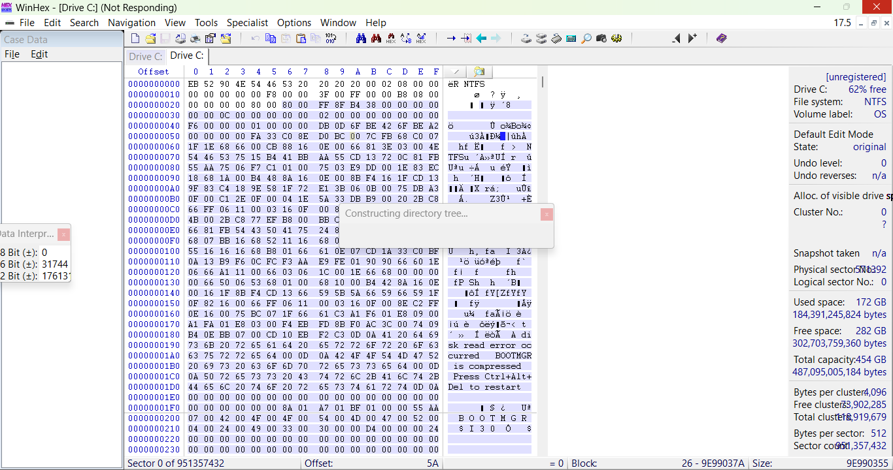

# Digital Forensics Lab – Autopsy & WinHex Analysis

## Project Overview

This lab demonstrates digital forensic analysis using Autopsy 4.3.0 and WinHex. The objective was to analyze a forensic image file (.E01), perform keyword searches, examine metadata, verify hash values, and construct a timeline of activity.

The investigation follows standard forensic methodology: acquisition, examination, analysis, and reporting.

---

## 1. Case Setup in Autopsy

### Case Initialization

A forensic image (.E01) was added as a data source in Autopsy. The case was configured with examiner information and the correct timezone (America/New_York).

---

## 2. Keyword Search Analysis

### Keyword Search Results

A keyword search for "M57" was performed across the image.

Findings:

- Multiple HTML artifacts contained the keyword
- References to internal IP addresses were identified
- User activity logs were recovered with associated timestamps

The results confirm user interaction related to the M57 dataset.

---

## 3. File Metadata and Hash Verification

### Metadata and Hash Values

Selected files were analyzed to review:

- Created timestamps
- Modified timestamps
- Accessed timestamps
- MD5 hash values
- Allocation status

The MD5 hash values were consistent and no mismatches were identified. File metadata aligns with recorded system activity.

---

## 4. Timeline Analysis

### Timeline Visualization

The Autopsy timeline tool was used to reconstruct system activity chronologically.

Observations:

- Increased activity during November and December 2009
- Concentrated modification events
- Repeated browser log updates

The timeline supports the keyword findings and provides chronological context.

---

## 5. WinHex Hex-Level Examination

### File Record Inspection

WinHex was used to examine raw NTFS file structures.

Observations:

- NTFS boot sector and file system structures confirmed
- ASCII content visible within allocated clusters
- No anomalies or corruption detected

Hex-level review validates file system integrity.

---

## 6. File Property Verification

### File Properties

File system properties were reviewed to confirm:

- File size consistency
- Allocation status
- Timestamp accuracy
- Attribute flags

All examined files were allocated and internally consistent.

---

## 7. Data Interpreter Verification

### Data Interpreter Panel

The data interpreter tool was used to validate:

- Hex to ASCII translation
- Logical sector alignment
- Proper NTFS structure interpretation

This confirms forensic accuracy at the binary level.

---

## Forensic Conclusion

Examination of the forensic image identified consistent user activity related to the M57 dataset. Keyword searches recovered relevant HTML artifacts containing internal IP addresses and session data.

Timeline reconstruction indicates concentrated system activity during late 2009. Metadata review and MD5 hash verification show no evidence of tampering or corruption. Hex-level inspection confirms NTFS structural integrity.

Based on the analysis performed, the forensic image appears intact and reliable. The recovered artifacts provide a defensible reconstruction of system and browser activity during the examined timeframe.

---

## Tools Used

- Autopsy 4.3.0
- WinHex
- MD5 Hash Verification
- Timeline Analysis
- Keyword Search (Literal and Regex)

---

## Skills Demonstrated

- Forensic Image Examination
- Keyword Artifact Identification
- Metadata and Hash Verification
- Timeline Reconstruction
- Hex-Level File Analysis
- Digital Evidence Documentation
